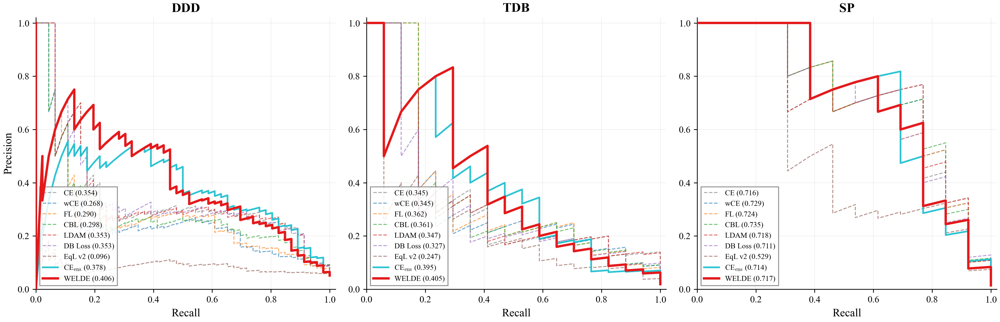
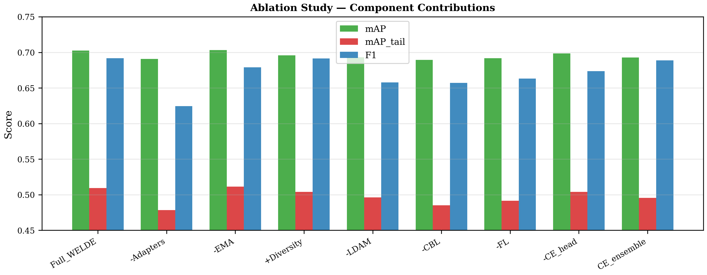
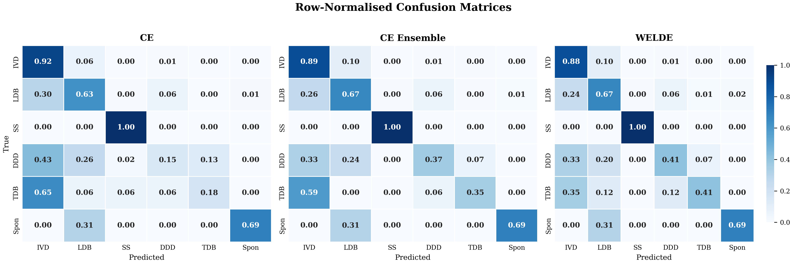
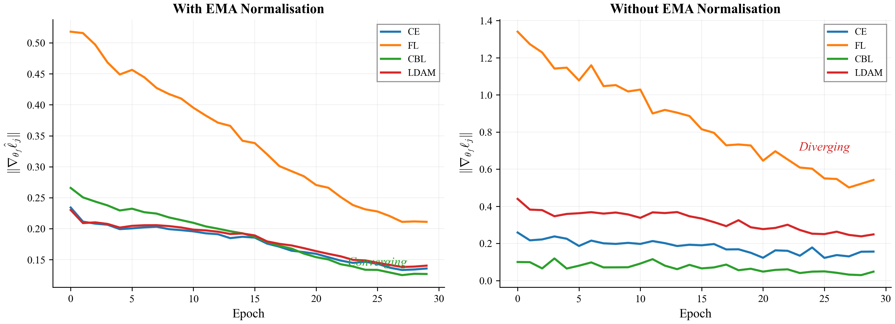
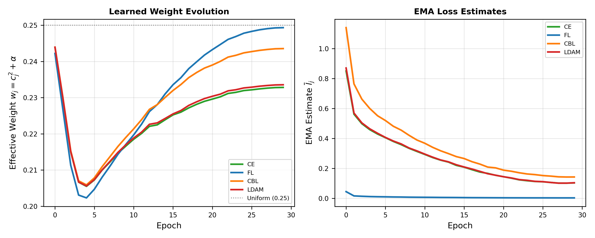
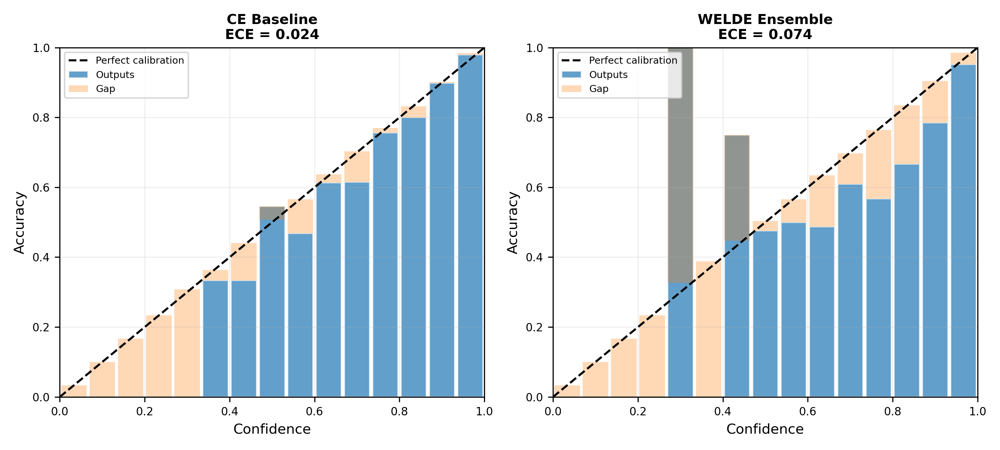
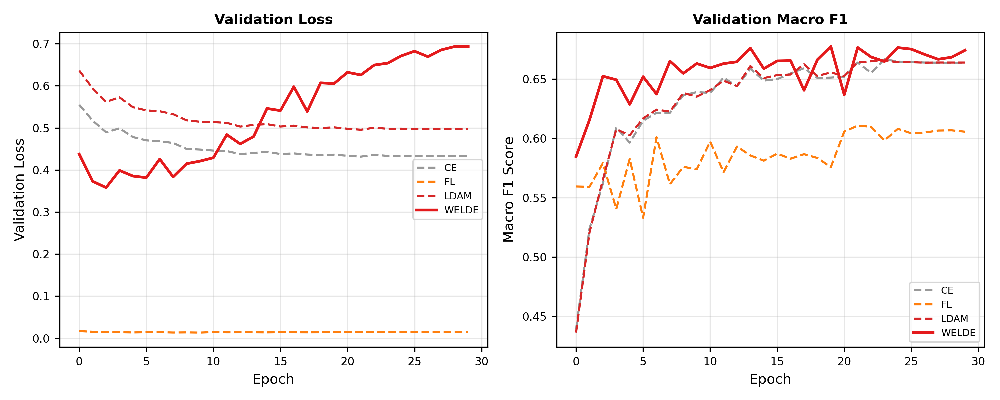
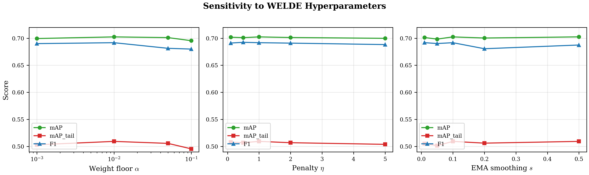
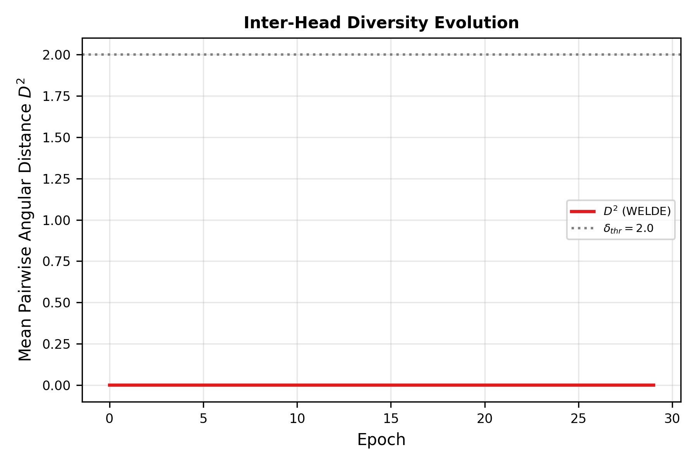
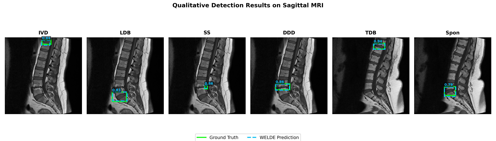

<div align="center">

# WELDE

### Weighted Ensemble Loss with Diversity Enhancement

**A unified framework for imbalanced object detection in medical imaging**

[](https://www.python.org/downloads/)
[](https://pytorch.org/)
[](LICENSE)
[](#citation)

</div>

---

## Overview

**WELDE** addresses the pervasive **long-tailed class imbalance** problem in medical image classification, where rare but clinically significant disorders are severely under-represented. Instead of relying on a single loss function, WELDE combines **four complementary loss functions** — Cross-Entropy, Focal Loss, Class-Balanced Loss, and LDAM — via per-head adapter projections, EMA-based normalisation, and learnable adaptive weighting with a relaxed sum-to-one penalty.

<div align="center">

<br><em>Figure: Row-normalised confusion matrices (CE vs WELDE) and tail-class AP / head-leakage comparison.</em>
</div>

### Key Contributions

- **Loss-Diversity Ensemble** — Four classification heads, each supervised by a distinct loss function (CE, FL, CBL, LDAM), cover the full imbalance spectrum: stable baseline signal, hard-example focus, effective sample-size correction, and decision-margin calibration.
- **Lightweight Per-Head Adapters** — Learnable adapter projections ($\mathbb{R}^{2048} \to \mathbb{R}^{512}$) allow each head to learn a head-specific feature subspace from a shared frozen backbone, providing implicit diversity without explicit regularisation.
- **EMA-Based Loss Normalisation** — Exponential moving average normalisation equilibrates gradient magnitudes across loss components, preventing any single loss from dominating the combined gradient.
- **Learnable Adaptive Weighting** — Squared-parameterised coefficients with a minimum weight floor ($\alpha = 0.01$) and a relaxed sum-to-one penalty ensure all losses contribute while allowing the framework to learn optimal weighting.
- **Cross-Domain Generalisability** — Validated not only on spinal disorders but also on the **DermaMNIST** (skin lesion) benchmark, demonstrating broad applicability.

---

## Results

### Spinal Disorder Classification (Primary Task)

6-class lumbar spine dataset derived from the RSNA 2024 Lumbar Spine Degenerative Conditions challenge. Classes exhibit severe imbalance (33.9:1 ratio between the most and least frequent class).

| Method | mAP | mAP<sub>tail</sub> | Macro-F1 | Accuracy |
|:---|:---:|:---:|:---:|:---:|
| CE | 0.689 | 0.472 | 0.613 | 0.813 |
| wCE | 0.665 | 0.448 | 0.592 | 0.744 |
| Focal Loss | 0.673 | 0.459 | 0.626 | 0.762 |
| CB Loss | 0.678 | 0.465 | 0.598 | 0.767 |
| LDAM | 0.689 | 0.471 | 0.614 | 0.815 |
| DB Loss | 0.684 | 0.463 | 0.575 | 0.807 |
| CE Ensemble | 0.693 | 0.496 | 0.689 | 0.820 |
| **WELDE (ours)** | **0.702** | **0.509** | **0.692** | **0.822** |

> WELDE achieves the **highest mAP and mAP<sub>tail</sub>**, improving tail-class performance by **+7.8%** over the best single-loss baseline (CE) and **+2.6%** over the architecture-matched CE Ensemble control.

<div align="center">

<br><em>Figure: Per-class precision–recall curves for all methods. WELDE (bold) consistently dominates on tail classes.</em>
</div>

### Ablation Study

| Variant | mAP | mAP<sub>tail</sub> | Macro-F1 |
|:---|:---:|:---:|:---:|
| **Full WELDE** | **0.702** | **0.509** | **0.692** |
| − Adapters | 0.691 | 0.478 | 0.624 |
| − EMA | 0.703 | 0.511 | 0.679 |
| + Diversity | 0.696 | 0.504 | 0.691 |
| − LDAM head | 0.693 | 0.496 | 0.658 |
| − CB Loss head | 0.689 | 0.485 | 0.657 |
| − Focal Loss head | 0.692 | 0.491 | 0.663 |
| − CE head | 0.699 | 0.504 | 0.674 |

<div align="center">

</div>

### External Validation — DermaMNIST (Skin Lesions)

Cross-domain 5-fold stratified CV on the DermaMNIST benchmark (7 classes, 10,015 images) to validate generalisability beyond spinal imaging.

| Method | mAP | mAP<sub>tail</sub> | Macro-F1 | Accuracy |
|:---|:---:|:---:|:---:|:---:|
| CE | 0.636 ± 0.012 | 0.566 ± 0.015 | 0.569 ± 0.009 | 0.789 ± 0.006 |
| LDAM | 0.633 ± 0.011 | 0.564 ± 0.014 | 0.568 ± 0.009 | 0.788 ± 0.005 |
| CE Ensemble | 0.706 ± 0.018 | 0.642 ± 0.036 | 0.648 ± 0.018 | 0.820 ± 0.003 |
| **WELDE (ours)** | **0.709 ± 0.015** | **0.651 ± 0.027** | 0.647 ± 0.015 | 0.814 ± 0.004 |

> WELDE generalises across imaging modalities — achieving the top mAP and substantially lower variance than CE Ensemble on DermaMNIST.

---

## Architecture

```
                    ┌──────────────────────┐
                    │  Frozen ResNet-50     │
                    │  Backbone (2048-d)    │
                    └──────────┬───────────┘
                               │
               ┌───────────────┼───────────────┐
               │               │               │
         ┌─────┴─────┐  ┌─────┴─────┐  ┌─────┴─────┐  ┌───────────┐
         │ Adapter 1  │  │ Adapter 2  │  │ Adapter 3  │  │ Adapter 4  │
         │ (CE head)  │  │ (FL head)  │  │ (CBL head) │  │ (LDAM head)│
         └─────┬─────┘  └─────┬─────┘  └─────┬─────┘  └─────┬─────┘
               │               │               │               │
         ┌─────┴─────┐  ┌─────┴─────┐  ┌─────┴─────┐  ┌─────┴─────┐
         │  CE Loss   │  │Focal Loss  │  │  CB Loss   │  │ LDAM Loss  │
         └─────┬─────┘  └─────┴─────┘  └─────┬─────┘  └─────┬─────┘
               │               │               │               │
               └───────────────┼───────────────┘
                               │
                    ┌──────────┴───────────┐
                    │  Adaptive Weighted   │
                    │     Aggregation      │
                    └──────────────────────┘
```

Each adapter is a small projection (`2048 → 512`) with batch normalisation, GELU, and dropout, followed by a 2-layer MLP classifier (`512 → 256 → C`). At inference, head outputs are aggregated by a weighted average using the learned adaptive weights $w_j = c_j^2 + \alpha$.

---

## Additional Figures

<details>
<summary><b>Confusion Matrices</b></summary>
<div align="center">

</div>
</details>

<details>
<summary><b>Gradient Magnitude Analysis</b></summary>
<div align="center">

</div>
</details>

<details>
<summary><b>Weight Evolution During Training</b></summary>
<div align="center">

</div>
</details>

<details>
<summary><b>Calibration Curves</b></summary>
<div align="center">

</div>
</details>

<details>
<summary><b>Training Curves</b></summary>
<div align="center">

</div>
</details>

<details>
<summary><b>Hyperparameter Sensitivity</b></summary>
<div align="center">

</div>
</details>

<details>
<summary><b>Head Diversity</b></summary>
<div align="center">

</div>
</details>

<details>
<summary><b>Qualitative MRI Results</b></summary>
<div align="center">

</div>
</details>

---

## Installation

```bash
# Clone the repository
git clone https://github.com/farhatmasood/welde.git
cd welde

# Create a conda environment (recommended)
conda create -n welde python=3.10 -y
conda activate welde

# Install dependencies
pip install -r requirements.txt

# Or install as a package
pip install -e .
```

---

## Usage

### 1. Prepare Data

Organise your YOLO-format detection crops into the following structure:

```
data/
├── train/
│   ├── images/    # PNG/JPG patches
│   └── labels/    # YOLO .txt files (class x y w h)
├── val/
│   ├── images/
│   └── labels/
└── test/
    ├── images/
    └── labels/
```

Set the data path via environment variable (or it defaults to `./data`):

```bash
export WELDE_DATA_ROOT=/path/to/your/data
export WELDE_OUTPUT_ROOT=/path/to/output    # defaults to ./results
```

### 2. Extract Features

Pre-extract frozen ResNet-50 backbone features for all patches:

```bash
python scripts/extract_features.py
```

This saves `.npy` feature arrays to `$WELDE_OUTPUT_ROOT/features/`.

### 3. Run the Full Pipeline

Train baselines, search for the best WELDE configuration, re-train with full logging, run ablation, sensitivity analysis, and bootstrap confidence intervals:

```bash
python scripts/run_pipeline.py
```

All results are saved to `$WELDE_OUTPUT_ROOT/` as JSON files.

### 4. Generate Figures

After the pipeline completes:

```bash
python scripts/generate_figures.py
```

Produces publication-ready PDF and PNG figures in `$WELDE_OUTPUT_ROOT/figures/`.

### 5. External Validation (DermaMNIST)

Run cross-domain validation on the DermaMNIST skin lesion benchmark:

```bash
python scripts/external_validation.py
```

This automatically downloads DermaMNIST, extracts features, and runs stratified 5-fold CV comparing CE, LDAM, CE Ensemble, and WELDE.

---

## Project Structure

```
welde/
├── welde/                     # Core Python package
│   ├── __init__.py            # Public API exports
│   ├── config.py              # Configuration (paths, hyperparameters)
│   ├── losses.py              # Loss functions (CE, FL, CBL, LDAM, WELDE)
│   ├── model.py               # Multi-head ensemble architecture
│   ├── trainer.py             # Training loop, evaluation, EMA
│   └── dataset.py             # YOLO-format patch dataset
├── scripts/                   # Runnable experiment scripts
│   ├── extract_features.py    # Feature extraction with frozen backbone
│   ├── run_pipeline.py        # Full experiment pipeline
│   ├── generate_figures.py    # Publication figure generation
│   └── external_validation.py # Cross-domain DermaMNIST validation
├── assets/                    # Pre-generated figures and tables
│   ├── figures/
│   └── tables/
├── requirements.txt
├── setup.py
├── LICENSE
└── README.md
```

---

## Configuration

Key hyperparameters (set in `welde/config.py` or overridden at runtime):

| Parameter | Default | Description |
|:---|:---:|:---|
| `WELDE_ALPHA` | 0.01 | Minimum weight floor (non-degeneracy guarantee) |
| `WELDE_ETA` | 0.1 | Relaxed sum-to-one penalty coefficient |
| `WELDE_S` | 0.1 | EMA smoothing factor |
| `WELDE_LAMBDA` | 0.0 | Diversity regularisation weight (disabled by default) |
| `FOCAL_GAMMA` | 2.0 | Focal Loss focusing parameter |
| `CBL_BETA` | 0.999 | CBL effective-number hyperparameter |
| `LDAM_C` | 0.1 | LDAM margin scaling constant |
| `LR` | 1e-4 | Learning rate (AdamW) |
| `NUM_EPOCHS` | 30 | Maximum training epochs |
| `BATCH_SIZE` | 64 | Batch size |
| `SEED` | 42 | Random seed |

---

## Citation

If you find this work useful, please cite:

```bibtex
@article{masood2025welde,
  title={{WELDE}: A Weighted Ensemble Loss with Diversity Enhancement for Imbalanced Object Detection in Medical Imaging},
  author={Masood, Rao Farhat and Taj, Imtiaz Ahmed},
  journal={Under Submission},
  year={2026},
  note={Under review}
}
```

---

## License

This project is licensed under the MIT License — see [LICENSE](LICENSE) for details.

---

<div align="center">
<sub>Built with PyTorch · Designed for reproducible medical AI research</sub>
</div>
